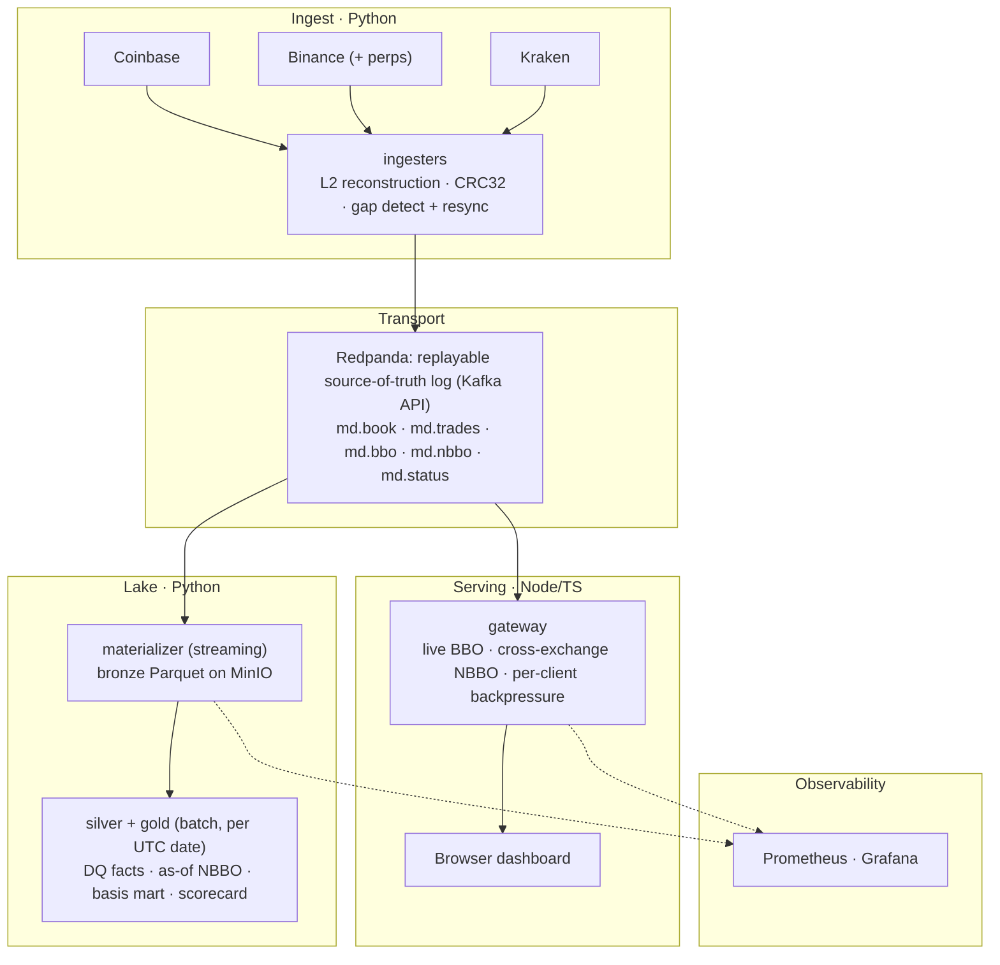

# crosstick

[](https://github.com/ryanp2718/crosstick/actions/workflows/ci.yml)
[](https://github.com/ryanp2718/crosstick/actions/workflows/determinism.yml)

**Real-time, cross-exchange cryptocurrency market-data platform.** It reconstructs
full L2 order books from Coinbase, Binance, and Kraken, derives a live
cross-exchange NBBO, and lands every event in a Parquet lake for replay and
analysis. The design is Kappa-shaped: Redpanda holds the raw feed as one durable,
replayable log, and every downstream stream and table is a pure function of it.

> **Status.** Both halves run on live exchange data. The streaming spine (ingest →
> Redpanda → gateway → NBBO → dashboard) is built and validated, and so is the
> batch lake (bronze → silver → gold), including a point-in-time-correct
> stablecoin-basis mart and a per-venue data-quality scorecard. What's left is the
> modelling surface: a feature store, a fee-aware backtest harness, and a cloud
> cutover.

## Offline demo

The fastest way to see the system run: no API keys, no exchange connectivity,
one command.

```powershell
docker compose -f demo/docker-compose.yml up --build
# open http://localhost:8080   (override the port with DEMO_GATEWAY_PORT)
docker compose -f demo/docker-compose.yml down
```

The demo plays back a real five-minute recording of the live market feed
(saved in `demo/corpus.jsonl.gz`) as if it were arriving right now, keeping the
original timing between messages. The exact same software that runs in
production reads this playback and works out, on the fly, each exchange's best
price and the single best price across all three exchanges, so the dashboard
looks and behaves just like a live market. The recording captures real moments
where the exchanges disagreed on price, which show up in red in the spread
column. When the recording runs out, the dashboard shows that the feed has
stalled, and shutting the demo down wipes everything, so the next start is
completely fresh. The demo also runs in full isolation from the main system, so
it can't touch or depend on anything else.

The determinism badge at the top of this README runs this same playback
automatically on every code change: playing the recording twice, each time from
a clean slate, has to produce identical results down to the last byte. That is
the proof that the system is fully reproducible.

## Architecture



## Highlights

- **Replayable by construction.** Every derived stream is a pure function of the
  raw log: `md.bbo.*` is computed from `md.book.*`, and `md.nbbo.*` is stamped and
  evicted in *stream time* (the max event-time across consumed messages, never
  `Date.now()`), so a replay reproduces it byte-for-byte. On restart the gateway
  re-derives its books from the log, seeking each topic by class (latest snapshot,
  deltas from a bounded lookback, status from earliest) rather than re-warming off
  the live edge.
- **Real L2 order-book reconstruction.** Bounded-depth books per venue
  (`SortedDict`), CRC32 checksum validation against the exchange, and sequence-gap
  detection with buffering and resync, all driven by a per-symbol
  `BOOTSTRAP → BUFFERING → LIVE → STALE` state machine.
- **Cross-exchange NBBO that respects the quote asset.** Best bid and offer across
  venues per canonical instrument, where `BTC-USD` (Coinbase, Kraken) is *never*
  merged with `BTC-USDT` (Binance): USDT is not USD, and the gap between them is a
  real basis, not noise.
- **Point-in-time-correct analytics.** The gold basis mart joins each base's USD
  and USDT NBBO with a backward-only as-of join, so no observation ever sees a
  future quote. A leg that has gone quiet past a staleness bound is dropped rather
  than carried forward into a fabricated price. All price math is `DECIMAL(38,18)`.
- **Connection-state venue eviction.** A dead ingester used to leave a frozen leg
  that could win the NBBO and print a phantom crossed book. Venues now heartbeat
  liveness on `md.status.*`, and the gateway evicts a venue's legs on explicit
  shutdown or missed-heartbeat timeout. The trigger is connection state, not naive
  quote-age gating. Crossed-NBBO alerting is floored by measurement, too: the spot
  venues routinely lock or cross by well under a basis point (p99 ~1.5 bps,
  measured 2026-07), so only a tens-of-bps inversion pages.
- **Backpressure that protects the hot path.** Per-client WebSocket send buffers
  are bounded; a slow consumer is dropped rather than allowed to stall fan-out for
  everyone.
- **A measured hot path.** Gateway performance work lands with before/after
  numbers: serializing each derived message once cut GC time per million messages
  ~3.8x (107.5k ms to 28.1k ms, measured 2026-07), and yielding the event loop
  during bursty catch-up batches cut `/metrics` stalls from ~14s to sub-second.
  Byte-identical replay gates every hot-path change.
- **A hard size ceiling, enforced end to end.** An 8 MiB limit holds across
  producer, broker, and consumer. Coinbase's re-encoded L2 snapshot runs ~1.1 MiB
  at current depth (the raw full-depth frame is ~5 MiB), so an oversize message
  fails loudly instead of silently truncating.
- **Observability throughout.** Prometheus metrics on every component, with a
  provisioned Grafana ops dashboard.

## Status & roadmap

**Built and validated against live data**

- [x] Python ingesters for Coinbase, Binance, and Kraken (L2 + trades, CRC, resync)
- [x] Redpanda transport with topic and schema contracts
- [x] Node/TS gateway: live BBO/spread, cross-exchange NBBO, backpressure,
      snapshot-on-connect
- [x] Venue-health liveness and NBBO leg eviction
- [x] Browser dashboard with staleness-aware greying and crossed-book warnings
- [x] Prometheus + Grafana ops dashboard, plus a lake/batch metrics exporter
- [x] CI gate (GitHub Actions): vitest, pytest, ruff, tsc on push/PR
- [x] Streaming materializer writing a bronze Parquet lake on MinIO, idempotent at
      the file grain (a crash re-reads the in-flight chunk and rewrites the
      identical object, so re-runs never duplicate or drop data)
- [x] Silver/gold batch transforms: data-quality facts, as-of-joined NBBO, the
      stablecoin-basis mart, and a per-venue data-quality scorecard
- [x] Cross-process integration harness: corpus replay through the real gateway
      over ephemeral Redpanda, including byte-identical NBBO determinism (the
      determinism badge above tracks exactly that test on `main`)
- [x] Offline demo: one-command paced corpus replay through an isolated compose
      stack, lighting the dashboard with no exchange connectivity
- [x] Perp capture (Binance USDⓈ-M): L2 book + aggTrade tape, liquidations,
      mark/funding, open-interest poll, on two routed WS connections; validated
      live end-to-end (book → NBBO `BTC-USDT-PERP` → bronze)

**Roadmap (the modelling surface)**

- [ ] Point-in-time feature store for downstream modelling, DIY first with Feast
      later (the gold mart's as-of joins are the groundwork)
- [ ] Fee- and latency-aware backtest harness over replay + silver
- [ ] Research features off the event-grain book (order-flow imbalance, queue
      dynamics, trade-sign autocorrelation)
- [ ] Long-horizon roll-ups and orchestration for the batch transforms
- [ ] Cloud cutover

## Tech stack

- **Ingest:** Python (asyncio, uvloop), aiokafka, msgspec, sortedcontainers; managed by [`uv`](https://docs.astral.sh/uv/).
- **Transport:** Redpanda (Kafka API).
- **Gateway:** Node 22 + TypeScript, kafkajs, `ws`, prom-client; tested with vitest.
- **Lake:** PyArrow + Parquet on MinIO (S3), written as idempotent, overwrite-keyed objects.
- **Observability:** Prometheus, Grafana.

## Repo layout

```
python/             ingesters + lake transforms (uv-managed)
  common/           msgspec models, kafka_io, lake helpers, as-of join, metrics, backoff
  ingest/           base_ingester state machine + per-exchange drivers (+ tests)
  materializer/     md.* topics → bronze Parquet, streaming (+ tests)
  silver/           bronze → DQ facts + nbbo/quotes, batch per date (+ tests)
  gold/             silver → basis mart + data-quality scorecard, batch (+ tests)
  exporter/         lake/batch metrics for Prometheus (+ tests)
  analytics/        capture + replay corpora for the integration harness and demo
node/gateway/       kafkajs → ws gateway: BBO, NBBO, backpressure (src/, test/)
dashboard/          static WS client, served by the gateway
demo/               offline demo: isolated compose stack + captured corpus fixture
ops/                instruments.yml, prometheus/ (config + alerts), grafana provisioning, smoke.py
docker-compose.yml  redpanda, minio, ingesters, materializer, gateway, lake-exporter, prometheus, grafana
docs/               architecture + design docs
```

## Quickstart

Prerequisites: Docker Desktop, [`uv`](https://docs.astral.sh/uv/) (Python),
`pnpm` (Node 22+). Commands below are PowerShell (Windows); translate `$env:X=...`
to `X=...` on a POSIX shell.

```powershell
# 1. Infrastructure
docker compose up -d redpanda prometheus grafana

# 2. Gateway (dev mode, on the host)
cd node/gateway; pnpm install
$env:KAFKA_BROKERS="localhost:19092"; pnpm exec tsx src/server.ts

# 3. An ingester (separate shell); give each a distinct METRICS_PORT
cd python; uv sync
$env:EXCHANGE="kraken"; $env:SYMBOLS="BTC/USD"
$env:KAFKA_BROKERS="localhost:19092"; $env:METRICS_PORT="9103"
.venv\Scripts\python.exe -m ingest.main

# 4. Dashboard → http://localhost:8080/
```

Dev mode runs the gateway and ingesters on the host against Redpanda's external
listener (`localhost:19092`); metrics ports per exchange are binance `9101`,
coinbase `9102`, kraken `9103`. Full container mode is via `docker compose`.
Operational notes for the observability stack (config mounts, smoke checks) live
in [`ops/README.md`](ops/README.md).

## Testing

```powershell
cd node/gateway; pnpm test                            # vitest
cd python; .venv\Scripts\python.exe -m pytest -q      # pytest
```

Both suites run on every push and PR through the CI workflow; the badge at the top
of this README reflects their current state.

## Design docs

The *why* behind the architecture lives in [`docs/`](docs/):

- [`DESIGN_orderbook.md`](docs/DESIGN_orderbook.md): order-book reconstruction on
  both paths, the ingester state machine, gap detection and resync, the gateway's
  order-insensitive rebuild and crossed-book heal, and snapshot-on-connect.
- [`DESIGN_nbbo.md`](docs/DESIGN_nbbo.md): cross-exchange NBBO, with strict quote
  bucketing, tie-breaks, per-leg staleness, and connection-state venue eviction.
- [`DESIGN_perp_capture.md`](docs/DESIGN_perp_capture.md): perp capture on Binance
  futures, ranked unbackfillable-first, over two routed WS connections.
- [`data-contracts.md`](docs/data-contracts.md): the wire envelopes and the
  bronze, silver, and gold lake schemas, topic by topic.
