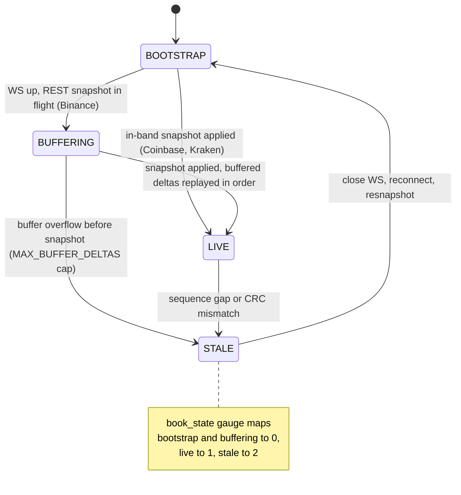
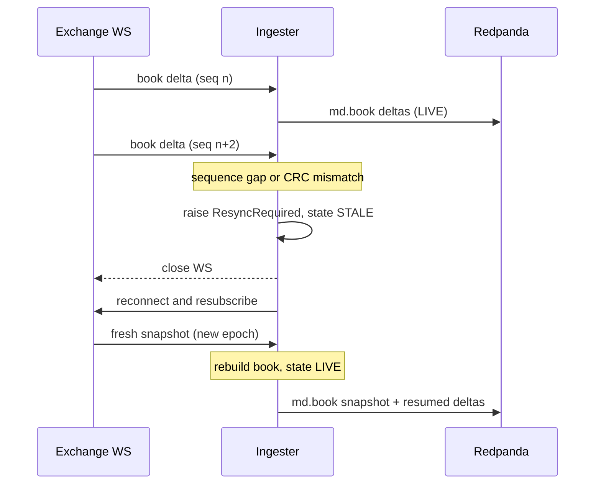
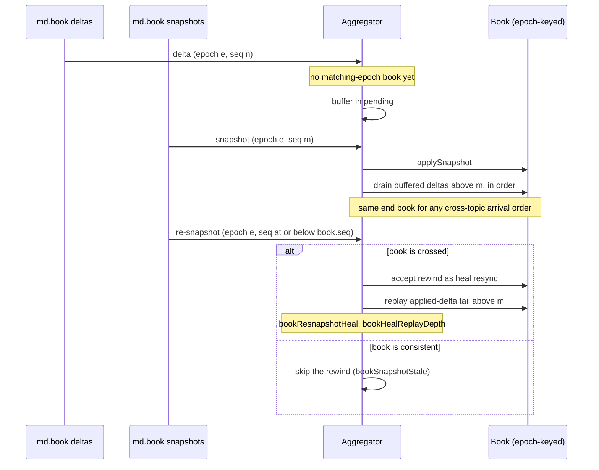
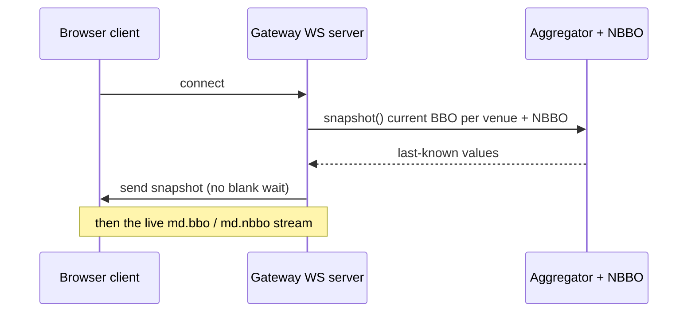

# Order-book reconstruction

The L2 book is reconstructed twice from the same primitives: live in the Python
ingester off each exchange WebSocket, and again in the Node gateway off the
Redpanda log (on warm start, and on every replay). Both paths have to converge to
the same book, which is what makes replay byte-identical (see
[adr/0001-byte-identical-replay-guarantee.md](adr/0001-byte-identical-replay-guarantee.md)).

Code is authoritative: `python/ingest/base_ingester.py` (the state machine),
`python/ingest/book.py` (the `OrderBook`, CRC32, invariants),
`node/gateway/src/aggregator.ts` (gateway reconstruction),
`node/gateway/src/warmstart.ts` (seek planning + the drain gate).

## Ingester state machine

Each symbol carries a `SymbolState` (`base_ingester.py`). `BOOTSTRAP` awaits the
first snapshot; `BUFFERING` covers the Binance pattern where the WS is up and
deltas accumulate while the REST snapshot is in flight; `LIVE` applies deltas
normally; `STALE` marks a detected gap or CRC mismatch that is awaiting resync. A
resync is a full reconnect and resnapshot rather than an in-place repair: a book
that has diverged cannot be trusted to patch itself.

## Gap detection and resync

`process_event` validates each delta against the book's sequence and the
exchange CRC. Anything inconsistent raises `ResyncRequired`, which the base
catches, marks the symbol `STALE`, and tears the connection down so the
connect-loop resnapshots from a clean slate. Dropping a delta to "keep going" is
never an option: a hole corrupts the book permanently, so a resync is always
preferred over a partial apply.

## Gateway reconstruction from the log

The gateway keeps one `Book` per `(exchange, symbol)` and derives the per-venue
BBO. It never trusts cross-topic arrival order: snapshots and deltas ride
separate topics, so a delta that arrives before its snapshot is buffered in
`pending` (never dropped) and drained in order once the matching snapshot lands.
Books are epoch-keyed because Coinbase and Kraken reset their per-connection
sequence counter on reconnect, so a prior connection's high-seq delta must not
out-rank a fresh snapshot's low seq; a delta only applies to a book of its own
epoch, compared by equality so clock skew cannot reorder it.

A same-epoch re-snapshot the book already passed is normally a skipped rewind.
The one exception is a crossed book: there `applySnapshot` accepts the rewind as
a heal, then replays the retained applied-delta tail (entries above the
snapshot's sequence) so the heal does not resurrect since-deleted levels. That
bounds a within-venue cross to one snapshot interval.

On warm start the gateway seeks each topic by class (latest snapshot within a
bounded lookback, deltas from the lookback cutoff, status from the cutoff,
trades at the live edge) and holds derived `md.bbo` / `md.nbbo` output behind a
`DrainGate` until every backlogged book partition reaches its startup high-water
mark. An ungated, unevenly draining replay would let a stale leg win the NBBO
against a stream clock a faster topic already pushed ahead, printing a phantom
cross; the gate closes that window. A clean start plans no drain target, so the
gate is never armed and live emission is unchanged (`warmstart.ts`).

## Serving a fresh client (snapshot-on-connect)

The gateway holds live state only in memory, so a client that connects during a
quiet period would otherwise sit blank until the next tick. On connect the server
replays the last BBO per venue and the current NBBO set, then switches the socket
to the live stream (`server.ts`).

