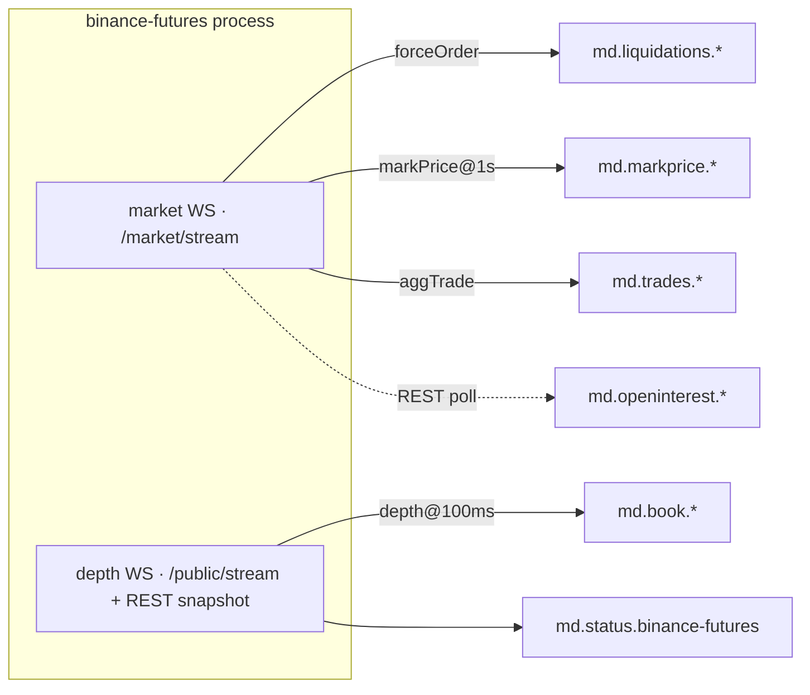

# Perp capture design (v1): Binance USDⓈ-M

Status: **Slices 1-3 built**: liquidations + mark/funding (slice 1), open
interest REST poll (slice 2, topic `md.openinterest.*`, payload `OpenInterest`
tag `oi`), perp L2 book + aggTrade tape (slice 3), all in
`python/ingest/binance_futures.py`.

## Goal

Start the clocks on perpetual-futures data that cannot be backfilled later.
`RESEARCH_thesis.md` §6 established the ranking: with the spot materializer
shipped (DESIGN_analytics.md Phases 0-1), perp *microstructure* is the only
data still decaying daily. Funding settlements and mark/index history are
REST-backfillable, so they justify zero urgency on their own; they ride along
here only because the same WS connection delivers them for free.

Unbackfillability ranking (drives the slices):

| Data | Backfill | Slice |
|---|---|---|
| Liquidations | None; REST `allForceOrders` removed, WS is the only source | **1** |
| Mark/index/funding-rate stream | Full: REST klines + funding history | 1 (free rider) |
| Open interest | Partial: ~30 days (`/futures/data/openInterestHist`, 5m grain) | 2 |
| Perp L2 book + trades | None | 3 |

## Decisions

### Venue identity: `binance-futures`, one process

A distinct exchange id (not a flag on the spot ingester): its own WS endpoint,
its own REST base, its own failure domain, its own `md.status.binance-futures`
heartbeat. Keeps the one-connection-per-exchange process model and means the
gateway's venue-health logic needs no changes.

### Canonical namespace: `BTC-USDT-PERP`

Binance's perp symbol is also `BTCUSDT`, so perps get their own canonical ids
in `ops/instruments.yml` (`BTC-USDT-PERP`, venue `binance-futures`). This
extends strict per-quote bucketing (DESIGN_nbbo.md): a perp can never
accidentally aggregate into the spot `BTC-USDT` NBBO, and the basis (perp vs
spot) stays a *computed* signal in gold, never a collapsed identity.

### Topics: two new shapes, same conventions

| Topic | Payload (tag) | Key | Cleanup |
|---|---|---|---|
| `md.liquidations.{exchange}.{symbol}` | `Liquidation` (`liq`) | `{exchange}:{symbol}` | delete |
| `md.markprice.{exchange}.{symbol}` | `MarkPrice` (`mark`) | `{exchange}:{symbol}` | delete |

Same envelope rules as every other `md.*` topic: msgspec-tagged JSON, decimal
strings, ns timestamps, latency headers. Perp book/trades (slice 3) reuse the
*existing* `md.book.*` / `md.trades.*` shapes under `exchange=binance-futures`.

### Bronze: two new datasets, nothing else

`materializer/bronze.py` learns `liquidations` and `mark_price` dataset
parses; the rest is free: the materializer already pattern-subscribes `^md\.`
and partitions by canonical, so `md.liquidations.binance-futures.BTCUSDT`
lands at `liquidations/exchange=binance-futures/symbol=BTC-USDT-PERP/date=.../`
with no service changes.

### Gateway interaction: analyzed, no changes needed

- The gateway subscribes only `^md\.book\.` / `^md\.trades\.` / `^md\.status\.`
  (`server.ts` TOPIC_PATTERNS); liquidation/markprice topics are invisible to it.
- Slice 3 perp book topics WILL flow into it: it derives per-venue BBO
  unconditionally and NBBO only on a successful `instruments.yml` lookup, so
  `BTC-USDT-PERP` yields `md.bbo.binance-futures.BTCUSDT` plus a single-leg
  `md.nbbo.BTC-USDT-PERP`. That single-leg NBBO is coherent, and strict bucketing isolates it.
- Caveat (pre-existing): kafkajs matches regex subscriptions against topics
  existing at subscribe time; restart the gateway after first perp produce.

## Wire contract (docs verified 2026-06-10; routing verified live 2026-06-11)

Base: the futures WS requires **routed paths** (legacy unrouted URLs sunset
2026-04-23), and the routing is **per stream type**: depth belongs to the
Public endpoint, aggTrade/markPrice/forceOrder to the Market endpoint. A
connection to one path *silently never delivers* the other path's streams
(verified live: an all-streams `/market/stream` connection delivers trades
and marks but zero depth frames; bare `/stream` delivers only depth). One
venue therefore needs two connections:

    wss://fstream.binance.com/market/stream?streams=btcusdt@forceOrder/btcusdt@markPrice@1s/btcusdt@aggTrade/...
    wss://fstream.binance.com/public/stream?streams=btcusdt@depth@100ms/...

`ingest.main` builds both as two instances of `BinanceFuturesIngester`
(`mode="market"` / `mode="depth"`) in one process. The depth instance owns
`md.status.binance-futures` (status exists to evict stale book legs from
NBBO); the market connection's liveness is observable via the markPrice@1s
cadence in `md_messages_received_total`. All streams are known at
construction, so each instance connects straight to its combined-stream URL
and never sends live SUBSCRIBE messages.

Combined-stream frames are enveloped `{"stream": "...", "data": {...}}`.
Connections are force-closed at 24h; the BaseIngester reconnect loop handles
it (market streams are stateless, so their cost is the gap window; the depth
connection re-bootstraps from a fresh REST snapshot like any resync).

- `<symbol>@forceOrder`: `e=forceOrder`, nested `o`: `s`, `S` (side of the
  forced order: SELL = long liquidated), `q` orig qty, `p` price, `ap` avg
  price, `X` status, `z` filled qty, `T` trade time (ms).
  **Sampled, not a tape:** only the *largest* liquidation per symbol per
  1000ms is pushed. Research must treat this as a lower bound / sampling of
  liquidation flow, never a complete record (RESEARCH_thesis.md §4).
- `<symbol>@markPrice@1s`: `e=markPriceUpdate`: `p` mark, `i` index, `P`
  estimated settle, `r` funding rate, `T` next funding time (ms), `E` event
  time (ms). 1s cadence chosen (vs 3s default): trivial volume, and it doubles
  as a liveness signal (`stale_timeout` works even when no liquidations occur).
- Slice 2, OI: REST `GET /fapi/v1/openInterest` (current) on a poll loop;
  `/futures/data/openInterestHist` (5m grain) reaches back only ~30 days.
- Slice 3, book/trades: futures has **only `@aggTrade`** (no raw trade
  stream), and the diff-depth continuity rule differs from spot: each event's
  `pu` must equal the previous event's `u` (spot: `U == prev_u + 1`), with the
  snapshot sync point `U <= lastUpdateId <= u` from
  `fapi.binance.com/fapi/v1/depth`. The spot sync code must NOT be
  copy-pasted.

## Upgrade path (not built)

`!forceOrder@arr` streams *all* symbols' liquidation snapshots on one
connection, the right move if/when research wants market-wide cascade
breadth rather than per-instrument depth. Requires a topic-granularity
decision (per-symbol topics for hundreds of symbols vs one keyed topic), so
it's deferred until a named consumer exists.

## Test plan

- **Unit (slice 1):** envelope/payload parsing, side mapping, ts conversion,
  URL construction; `process_event` → emitted `Liquidation`/`MarkPrice`
  round-trip via `models.decode`, topic/key/header conventions.
- **Bronze:** `parse_topic` + `object_key` cases for the two datasets,
  including canonical resolution to `*-PERP`.
- **Integration:** the golden corpus carries a binance-futures segment (book,
  tape, markprice, liquidation, openinterest), so the bronze==corpus and
  gateway tests cover the perp path, including the BTC-USDT-PERP vs BTC-USDT
  canonical split.

## Out of scope (v1)

- COIN-M futures, options.
- Other perp venues (Bybit, OKX): the same canonical `-PERP` namespace will
  apply when they land.
- Backfill jobs for funding/klines/OI history (REST-pullable any time; do it
  when silver needs them).
