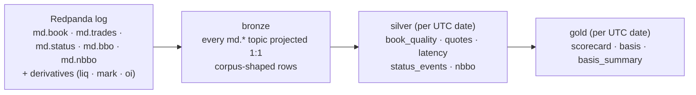

# Data contracts

The wire contract for everything on the Redpanda log, plus the corpus file
format used by the replay harness. Code is authoritative; this doc is the
cross-language map:

- **Payload types:** `python/common/models.py` (msgspec Structs), mirrored by
  `node/gateway/src/messages.ts`.
- **Topic naming:** `python/common/kafka_io.py`, mirrored by
  `node/gateway/src/messages.ts`.
- **Corpus format:** `python/analytics/corpus.py`.

A divergence between the Python and Node mirrors is a bug. A cross-language
oracle that would catch it mechanically is a known gap, not yet built.

The log is the source of truth; bronze mirrors it verbatim, and every silver and
gold table is a batch projection of bronze:

## Topics

| Topic | Producer | Payload (tag) | Key | Cleanup |
|---|---|---|---|---|
| `md.book.{exchange}.{symbol}.snapshots` | ingester | `BookSnapshot` (`snap`) | `{exchange}:{symbol}` | delete |
| `md.book.{exchange}.{symbol}.deltas` | ingester | `BookDelta` (`delta`) | `{exchange}:{symbol}` | delete |
| `md.trades.{exchange}.{symbol}` | ingester | `Trade` (`trade`) | `{exchange}:{symbol}` | delete |
| `md.status.{exchange}` | ingester | `Status` (`status`) | `{exchange}` | compact |
| `md.bbo.{exchange}.{symbol}` | gateway | `BBO` (`bbo`) | `{exchange}:{symbol}` | delete |
| `md.liquidations.{exchange}.{symbol}` | ingester (derivatives) | `Liquidation` (`liq`) | `{exchange}:{symbol}` | delete |
| `md.markprice.{exchange}.{symbol}` | ingester (derivatives) | `MarkPrice` (`mark`) | `{exchange}:{symbol}` | delete |
| `md.openinterest.{exchange}.{symbol}` | ingester (derivatives, REST poll) | `OpenInterest` (`oi`) | `{exchange}:{symbol}` | delete |
| `md.nbbo.{canonical_id}` | gateway | `NBBOMsg` (`nbbo`, messages.ts only) | `{canonical_id}` | compact |

- `{symbol}` in a **topic name** is the normalized form (`normalize_symbol`:
  any character outside `[a-zA-Z0-9._-]` becomes `-`; Kraken's `BTC/USD` →
  `BTC-USD`). The native symbol is preserved in the message body (`symbol`
  field); it is **not** in a record header. Record **keys** carry the native
  form (e.g. `kraken:BTC/USD`).
- `{canonical_id}` is `<BASE>-<QUOTE>` from `ops/instruments.yml`. Quote
  currencies are strictly bucketed (USD ≠ USDT); see `DESIGN_nbbo.md`.
- The gateway pre-creates the compacted `md.nbbo.*` / `md.status.*` topics at
  startup; firehose topics are auto-created on first produce and inherit the
  cluster default cleanup (delete).
- Keys exist for log semantics (compaction identity, future partition
  affinity). Ordering today comes from single-partition topics, not keys.
- `NBBOMsg` is gateway-emitted JSON defined only in `messages.ts`; the Python
  streaming decoder (`models.decode`) does not cover it. `Spread` and `VWAP`
  exist in `models.py` but are not published on any live topic.
- `md.book.*.snapshots` carries bootstrap/resync snapshots **and** periodic
  re-emissions of the live local book (every `snapshot_interval_s`, default
  300 s). Re-emitted snapshots are shape-identical, with `sequence` = the
  book's current sequence and `exchange_ts_ns = 0` (locally generated, no
  exchange event behind them); they bound the delta tail a warm-starting
  consumer must replay to one interval.
- `BookSnapshot` / `BookDelta` carry an `epoch` (per-WS-connection generation,
  default `0`). coinbase/kraken reset `sequence` on each reconnect, so the
  gateway only applies a delta to a book of the same `epoch`, so a prior
  connection's deltas can't corrupt a fresh snapshot. Compared by equality only
  (never as a clock); pre-epoch records decode as `0`.
- `NBBOMsg.local_ts_ns` and per-leg `leg_age_ms` are **stream time** (the max
  event-time across the gateway's consumed messages at compute, not wall
  clock), so `md.nbbo.*` replays byte-for-byte (see ADR-0001). In
  live operation stream time tracks wall clock within consumer lag (ms).

## Retention

Delete-policy topics inherit the cluster `log_retention_ms`, set to **30 days**
by `redpanda-init` in `docker-compose.yml` (Redpanda's default is 7 days).
Until the materializer (Phase 1) projects topics to the lake, the log is the
only store, so retention is the data-loss horizon. Compacted topics keep the
latest record per key indefinitely.

**Bronze lake lifecycle.** The materializer now persists bronze to the `lake`
bucket, so the log is just the replay buffer. To stop the lake growing unbounded,
`minio-init` sets a MinIO lifecycle rule expiring raw `lake` objects after **30
days** (matching `log_retention_ms`); verify with `mc ilm rule ls local/lake`.
On the dev box this is generous (~200 GB free is months of headroom), and it
deletes nothing until objects age past 30 days. The horizon is the
raw-history-vs-disk tradeoff; the durable layer's real fix is off-box object
storage with tiered lifecycle, where the identical S3 lifecycle
API applies unchanged.

## Payload encoding

- msgspec-tagged JSON; the tag field is `t` (`snap` / `delta` / `trade` /
  `bbo` / `spread` / `status` / `nbbo` / `liq` / `mark` / `oi`).
- Prices and sizes are decimal **strings** end-to-end (no float drift);
  convert at the boundary where math is needed.
- Book levels are `[price, size]` string arrays (`BookLevel` is `array_like`).
- Timestamps are epoch **nanoseconds** (`*_ts_ns`). They exceed 2^53, so
  Node's `JSON.parse` rounds them to ~200ns granularity (see the NOTE in
  `messages.ts`); do not treat gateway-side values as exact.
- Hard ceiling: **8 MiB** per message pre-compression (`MAX_MESSAGE_BYTES`),
  mirrored at the producer, the broker (`kafka_batch_max_bytes`), and the
  gateway consumer. Producers use gzip; the broker stores whatever codec the
  producer used, so non-gzip producers are a contract violation (the gateway
  only decodes gzip).

## Record headers

Firehose records (book, trades, liquidations, markprice, openinterest) carry
latency-tracking headers (`latency_headers()` in `kafka_io.py`):

| Header | Value |
|---|---|
| `local_recv_ts_ns` | ingester receive time, epoch ns (ASCII integer) |
| `exchange_ts_ns` | exchange-reported event time, epoch ns (ASCII integer) |

Status and gateway-derived records (bbo/nbbo) carry no headers.

## Bronze lake (materializer)

The materializer (`python/materializer`) projects every `md.*` topic verbatim
to Parquet on the `lake` bucket, the insurance layer of the medallion plan.
Object paths are Hive-partitioned, canonical-resolved
via `ops/instruments.yml`:

| Dataset | Source topics | Path |
|---|---|---|
| `book_snapshots`, `book_deltas` | `md.book.*` | `{dataset}/exchange={ex}/symbol={canonical}/date={YYYY-MM-DD}/` |
| `trades` | `md.trades.*` | same |
| `bbo` | `md.bbo.*` | same |
| `liquidations` | `md.liquidations.*` | same |
| `mark_price` | `md.markprice.*` | same |
| `open_interest` | `md.openinterest.*` | same |
| `status` | `md.status.*` | `status/exchange={ex}/date=.../` |
| `nbbo` | `md.nbbo.*` | `nbbo/symbol={canonical}/date=.../` |

- **Object naming:** `{partition:03d}-{start_offset:012d}.parquet`, keyed by
  the chunk's **start offset only** (Kafka Connect S3-sink convention). The
  end offset of a chunk is wall-clock-dependent (the age flush), but the start
  is always the committed consumer offset, so a crash-retry rewrites the
  *identical* key, turning at-least-once into exactly-once at the file grain.
  End offset and record count live in the Parquet footer metadata
  (`crosstick:start_offset` / `end_offset` / `record_count` /
  `format = bronze-v1`). Chunks are contiguous per topic-partition, so a
  sorted listing implies coverage.
- **Rows are corpus-shaped:** the columns are exactly the `CorpusRecord`
  fields below (`topic`, `partition`, `offset`, `timestamp_ms`, `key`,
  `value`, `headers`); any bronze slice reads back as replay fodder.
- **Chunk cuts:** size-dominant (`FLUSH_BYTES`, 16 MiB), plus a UTC
  date-boundary cut (keeps `date=` partitions honest) and an age sweep
  (`FLUSH_INTERVAL_SEC`, the bronze-lag bound for cold topics, not the
  primary trigger). Compression is zstd.
- **Commit discipline:** offsets are committed only *after* the Parquet PUT,
  one chunk at a time, so at most one PUT is ever un-committed, which is what
  makes the start-offset overwrite argument airtight. The consumer group
  (`materializer`) is the durable "how far has bronze got" cursor.
- Unmapped `(exchange, symbol)` pairs partition by the normalized native
  symbol (warn-once); bronze never drops data over missing reference data.

## Silver datasets

`python -m silver.main <date>` reads bronze and writes the validated/reconstructed
silver datasets (the data-quality and basis slices) to the `silver` bucket. Values are decoded once (`common.models.decode`) and books reconstructed
through the real `ingest.book.OrderBook`, the same engine as live ingest, so the
facts agree with the gateway's live metrics by construction. Hive-partitioned,
canonical-resolved; **one overwrite-keyed `part.parquet` per partition** (a layer
aggregates a whole date, so a recompute rewrites the object: idempotent, the same
discipline as bronze's start-offset keys, but at date grain).

| Dataset | Path | Row = | Key columns |
|---|---|---|---|
| `book_quality` | `book_quality/exchange={ex}/symbol={canon}/date={d}/` | one book event | `kind` (snap/delta), `offset`, `sequence`, `epoch`, `exchange_ts_ns`, `local_ts_ns`, `local_recv_ts_ns`, `best_bid`/`best_ask` (`DECIMAL(38,18)`), `seq_gap`, `crossed`, `invariant_kind` |
| `latency` | `latency/exchange={ex}/symbol={canon}/date={d}/` | one firehose record | `dataset`, `offset`, `exchange_ts_ns`, `exchange_to_recv_ns`, `exchange_to_emit_ns` |
| `status_events` | `status_events/exchange={ex}/date={d}/` | one venue status | `ts_ns`, `state`, `prev_state`, `is_transition`, `downtime_ns` |
| `quotes` | `quotes/exchange={ex}/symbol={canon}/date={d}/` | one valid two-sided book event | `ts_ns`, `best_bid`/`best_ask`, `bid_sz`/`ask_sz` (`DECIMAL(38,18)`) |
| `nbbo` | `nbbo/symbol={canon}/date={d}/` | one cross-venue NBBO tick | `ts_ns`, `best_bid`/`best_ask` (`DECIMAL(38,18)`), `bid_venue`, `ask_venue`, `n_venues` |

- **`crossed`/`invariant_kind`** come from the OrderBook fold per
  `(exchange, symbol, epoch)`; a violation resyncs (clear) like the ingester. The
  book is reconstructed to **top-of-1**; full-depth cadence book-state + checksum
  verification are Phase 4 and extend this layer.
- **`seq_gap`** counts monotonic-but-missing deltas under a per-exchange policy:
  kraken's synthesized per-book counter is **contiguous** (a hole = ingest→bronze
  loss); coinbase (connection-wide counter shared across channels) and
  binance/binance-futures (update-ids) are **monotonic-only** (forward jumps are
  normal). Non-monotonic regressions are caught for all venues by the OrderBook
  fold (`non_monotonic_seq`).
- **`latency`** skips locally-generated records (`exchange_ts_ns == 0`:
  re-emitted snapshots, binance(-futures) snapshots, with no exchange clock behind
  them). Cross-venue `exchange_ts_ns` comparisons inherit the clock-domain caveat
  (ingest and gateway share one clock). `bbo`/`nbbo` carry no headers and are validated live by
  the gateway, so they are not re-checked here.
- **`quotes`/`nbbo`** are the basis-slice additions.
  `quotes` is per-venue top-of-1 from the *same* OrderBook fold as `book_quality`
  (crossed/one-sided events skipped); `nbbo` is the per-canonical max-bid/min-ask
  across a canonical's venues (strict per-quote bucketing), evicting a venue's leg
  while its `status` is down (`DESIGN_nbbo.md` connection-state eviction). The
  per-venue BBO oracle checks reconstructed `quotes` against the captured bronze
  `bbo`.

## Gold scorecard (data-quality mart)

`python -m gold.main <date>` aggregates the silver facts into the scorecard mart
on the `gold` bucket (a gold mart reads silver, never bronze). One overwrite-keyed
object per date: `scorecard/date={d}/part.parquet`. Plain Parquet (DuckDB-queryable
ad-hoc; dbt formalizes gold marts at Phase 4/5, over typed silver).

Fact table keyed `(exchange, canonical_symbol, date, check)`:

| Column | Meaning |
|---|---|
| `n_records`, `n_violations` | denominator + the headline pass/fail count for the check |
| `p50_ms` / `p95_ms` / `p99_ms` | latency percentiles (latency checks only; null otherwise) |
| `detail` | compact JSON breakdown (by-kind invariant counts, `total_missing`, `downtime_sec`, ...) |

Checks: `sequence_gap`, `book_invariant`, `coverage` (per book symbol);
`latency.{dataset}` (per firehose dataset); `venue_uptime` (per exchange,
`canonical_symbol` null). `--fail-on-violation` makes `gold.main` exit non-zero
for ops/CI gating.

## Gold basis mart (stablecoin USDT/USD basis)

`python -m gold.main <date>` also builds the stablecoin-basis mart from the silver
`nbbo` dataset (a gold mart reads silver, never bronze). For each base quoted in
both USD and USDT (e.g. `BTC-USD` vs `BTC-USDT`; perp `-PERP` canonicals
excluded), it as-of joins the two NBBO series (backward-only, so each observation
is point-in-time correct) and emits the basis where **both** legs have a valid
two-sided NBBO. Two overwrite-keyed objects per date:

| Dataset | Path | Row = | Key columns |
|---|---|---|---|
| `basis` | `basis/date={d}/` | one tick (either leg moved) | `base`, `ts_ns`, `usd_mid`, `usdt_mid`, `basis_abs`, `basis_bps`, `usd_bid`/`usd_ask`/`usdt_bid`/`usdt_ask` (`DECIMAL(38,18)`; `basis_bps` float) |
| `basis_summary` | `basis_summary/date={d}/` | one base/day | `n_obs`, `basis_bps_mean`/`std`/`median`/`min`/`max`/`p1`/`p99`, `coverage_ns` |

`basis_abs = usd_mid - usdt_mid`; `basis_bps = basis_abs / usd_mid * 1e4`. This is
the first signal driven through the full research spine;
the later ladder rungs (price-discovery, carry, OFI) reuse the same as-of join.

## Corpus format (replay harness)

A corpus is a gzipped JSON-lines file (`.jsonl.gz`), one `CorpusRecord` per
line, in capture order:

| Field | Meaning |
|---|---|
| `topic`, `partition`, `offset` | provenance from the source log |
| `timestamp_ms` | Kafka record timestamp (ms) |
| `key`, `value` | raw bytes, base64-encoded by msgspec's JSON codec |
| `headers` | `[name, base64-bytes]` pairs (including the latency headers) |

Replay (`analytics/replay.py`) sends every record to **partition 0** of its
original topic; the broker assigns fresh offsets `0..N-1`. Per-topic order is
preserved exactly; **cross-topic order is not**, but the gateway no longer
needs it imposed: a delta arriving before its stream's snapshot is buffered
and drained in order (see ADR-0001). Replay determinism is asserted
end-to-end in `analytics/tests/test_gateway_integration.py`: an adversarial
all-deltas-first replay converges to the same end state, and the same replay
run twice produces byte-identical `md.bbo.*` / `md.nbbo.*` streams.
